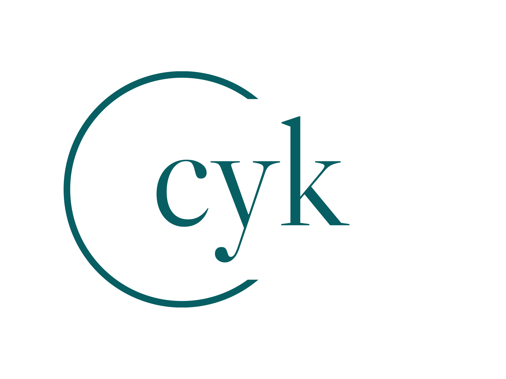

<!-- PROJECT SHIELDS -->

[![Contributors][contributors-shield]][contributors-url] [![Forks][forks-shield]][forks-url] [![Stargazers][stars-shield]][stars-url] [![Issues][issues-shield]][issues-url] [![license][license-shield]][license-url]

<!-- PROJECT LOGO -->
 

  

<h3 align="center">chomsky</h3>

  
A CLI-based program to generate a CYK table for any given grammar in Chomsky Normal Form (CNF)     
    <a href="https://github.com/greydelta/cyk"><strong>Explore the docs »</strong></a>
     
     
    <a href="https://github.com/greydelta/cyk">View Demo</a>
    ·
    <a href="https://github.com/greydelta/cyk/issues">Report Bug</a>
    ·
    <a href="https://github.com/greydelta/cyk/issues">Request Feature</a>
  

<!-- ABOUT THE PROJECT -->

## About The Project

### Program description:

The user will be able to either (1) load from file OR (2) input manually the regular grammar which will be checked against an input string. The first step will involve checking the starting variable of each input. Then step 2 will compare each variable to the neighbouring variable. Step 3 onwards will involve determining the initial coordinates of the position, then updating the coordinates as it traverses down each row. Each variable will be compared against the string to get the corresponding variable.

Scenarios where more than 1 variable are present to be compared can also be handled by the system. A CYK table will then be generated based on the grammar to determine if the string is part of the language.

### Program flowchart:

[![flowchart][media-flowchart]](#)

### Program output:

[![output][media-output]](#)

(<a href="#top">back to top</a>)

### Built With

(<a href="#top">back to top</a>)

<!-- GETTING STARTED -->

## Getting Started

## Using  :

#### Prerequisites

- Install [Extension Pack for Java](vscode:extension/vscjava.vscode-java-pack)

#### Installation

- Import Project Folder in VS Code

#### Usage

1. Right click on `App.java`

1. Click "Run Java"

(<a href="#top">back to top</a>)

<!-- CONTRIBUTING -->

## Contributing

Contributions are what make the open source community such an amazing place to learn, inspire, and create. Any contributions you make are **greatly appreciated**.

If you have a suggestion that would make this better, please fork the repo and create a pull request. You can also simply open an issue with the tag "enhancement". Don't forget to give the project a star! Thanks again!

1. Fork the Project
2. Create your Feature Branch (`git checkout -b feature/AmazingFeature`)
3. Commit your Changes (`git commit -m 'Add some AmazingFeature'`)
4. Push to the Branch (`git push origin feature/AmazingFeature`)
5. Open a Pull Request

(<a href="#top">back to top</a>)

<!-- LICENSE -->

## License

Distributed under the GNU AGPLv3 License. See `LICENSE.txt` for more information.

(<a href="#top">back to top</a>)

<!-- CONTACT -->

## Contact

[@greydelta1](https://twitter.com/greydelta1)

Project Link: [https://github.com/greydelta/cyk](https://github.com/greydelta/cyk)

(<a href="#top">back to top</a>)

<!-- ACKNOWLEDGMENTS -->

## Acknowledgments

### Collaborators

- [@lemonadeblue](https://github.com/lemonadeblue)

(<a href="#top">back to top</a>)

<!-- MARKDOWN LINKS & IMAGES -->

[contributors-shield]: https://img.shields.io/github/contributors/greydelta/cyk.svg?style=for-the-badge
[contributors-url]: https://github.com/greydelta/cyk/graphs/contributors
[forks-shield]: https://img.shields.io/github/forks/greydelta/cyk.svg?style=for-the-badge
[forks-url]: https://github.com/greydelta/cyk/network/members
[stars-shield]: https://img.shields.io/github/stars/greydelta/cyk.svg?style=for-the-badge
[stars-url]: https://github.com/greydelta/cyk/stargazers
[issues-shield]: https://img.shields.io/github/issues/greydelta/cyk.svg?style=for-the-badge
[issues-url]: https://github.com/greydelta/cyk/issues
[license-shield]: https://img.shields.io/github/license/greydelta/cyk.svg?style=for-the-badge
[license-url]: https://github.com/greydelta/cyk/blob/master/LICENSE.txt
[media-flowchart]: cyk-flowchart.png
[media-output]: sample_output.png
